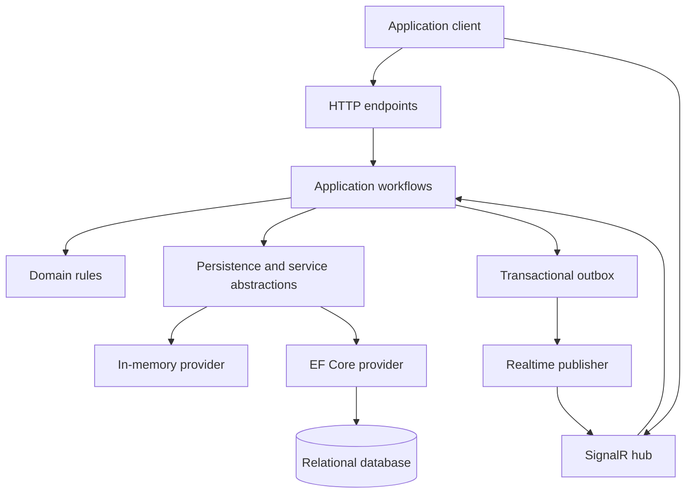

# Soga — Architecture and Engineering Guide

**Status:** Initial authoritative engineering direction  
**Date:** 15 September 2026  
**Applies to:** Soga focused V1  
**Owner:** Zhuwa Africa Limited

---

## 1. Purpose

This document defines how Soga should be designed and implemented. It protects the project from inconsistent architecture, security shortcuts, accidental coupling, and premature complexity.

The focused V1 scope is defined separately in `SOGA_FOCUSED_V1_RELEASE_PLAN.md`. The repository README is an introduction for users; this guide is for maintainers and contributors.

The primary architecture goal is:

> Make secure, durable, idempotent, recoverable direct messaging easy to host in an existing ASP.NET Core application.

---

## 2. Core engineering principles

1. **The database is the durable source of truth.** SignalR is never treated as storage.
2. **Persist before publishing.** A message is accepted only after its transaction commits.
3. **Authenticate and authorize every operation.** Connection membership is not authorization.
4. **Derive identity from trusted server context.** Never accept the acting user or tenant from request payloads.
5. **Design for retries.** HTTP requests, outbox events, and realtime events may be delivered more than once.
6. **Order messages per conversation.** Do not promise meaningless global message ordering.
7. **Recover through durable synchronization.** Realtime delivery is an optimization, not a correctness dependency.
8. **Keep public APIs small.** Every public type becomes a compatibility commitment.
9. **Prefer explicit behavior over magic.** Configuration, errors, transactions, and guarantees must be understandable.
10. **Complete single-instance correctness first.** Distributed scale-out comes after the core model is proven.

---

## 3. Architecture style

Soga is a feature-oriented modular monolith distributed initially as two NuGet packages:

```text
Soga
Soga.EntityFrameworkCore
```

Architectural layers are internal implementation boundaries, not separate public packages.



### Dependency direction

```text
Endpoints/Hub → Application workflows → Domain and abstractions
EF Core implementation → Domain and persistence abstractions
Domain → no ASP.NET Core, SignalR, or EF Core dependency
```

The domain must remain testable without a web host, SignalR connection, or database provider.

---

## 4. Recommended repository structure

```text
soga-dotnet/
├── src/
│   ├── Soga/
│   │   ├── Abstractions/
│   │   ├── Configuration/
│   │   ├── Identity/
│   │   ├── Tenancy/
│   │   ├── Conversations/
│   │   │   ├── Domain/
│   │   │   ├── Commands/
│   │   │   ├── Queries/
│   │   │   ├── Contracts/
│   │   │   └── Endpoints/
│   │   ├── Messages/
│   │   ├── ReadState/
│   │   ├── Synchronization/
│   │   ├── Realtime/
│   │   ├── Persistence/
│   │   │   └── InMemory/
│   │   ├── Security/
│   │   ├── Diagnostics/
│   │   ├── Errors/
│   │   └── Extensions/
│   └── Soga.EntityFrameworkCore/
│       ├── Configuration/
│       ├── Entities/
│       ├── Mapping/
│       ├── Repositories/
│       ├── Transactions/
│       ├── Synchronization/
│       ├── Outbox/
│       └── Extensions/
├── tests/
│   ├── Soga.Tests/
│   ├── Soga.IntegrationTests/
│   ├── Soga.EntityFrameworkCore.Tests/
│   ├── Soga.ArchitectureTests/
│   └── Soga.LoadTests/
├── samples/
│   ├── Soga.MinimalSample/
│   └── Soga.MarketplaceSample/
├── docs/
│   ├── getting-started/
│   ├── concepts/
│   ├── security/
│   ├── deployment/
│   └── decisions/
├── Directory.Build.props
├── Directory.Packages.props
├── global.json
├── Soga.slnx
├── README.md
├── LICENSE
├── CONTRIBUTING.md
├── CODE_OF_CONDUCT.md
└── SECURITY.md
```

Organize code primarily by feature. Avoid large generic folders containing unrelated handlers, models, or services from every feature.

---

## 5. Domain boundaries

### Conversation

A conversation owns membership and message ordering. V1 supports direct conversations only.

Important invariants:

- A direct conversation has exactly two intended participants.
- Only active participants may read or send messages.
- Direct-conversation uniqueness is enforced by the database, not only application code.
- Conversation activity changes when a message is accepted.
- The optional external reference participates in uniqueness only if the selected policy says so.

### Participant

A participant connects an opaque host user ID to a conversation.

Important invariants:

- A user appears at most once in a conversation.
- Read position never decreases.
- Leaving or removal prevents future access unless a documented history policy allows otherwise.
- Tenant boundaries are present in all lookups and constraints.

### Message

A message is durable data accepted into a conversation.

Important invariants:

- Sender identity comes from the authenticated context.
- The sender is an active participant.
- The client message ID is required and bounded.
- The idempotency tuple is unique.
- Content passes size and validation rules.
- Sequence is unique and monotonically increasing inside its conversation.
- Created time is generated by the server clock.

### Read state

V1 stores a participant's last-read conversation sequence instead of creating one receipt row for every message.

This provides efficient unread calculations:

```text
unread = count(messages where sequence > participant.lastReadSequence)
```

Whether a user's own messages count as unread must be explicitly decided and tested. The recommended behavior is that they do not.

---

## 6. Identity and tenancy

### Identity

- Treat host user IDs as opaque normalized strings unless an ADR selects another representation.
- Define maximum length and case-sensitivity explicitly.
- Never query the host user table directly from core Soga workflows.
- Use an optional user-profile abstraction for display information.
- Do not store access tokens.
- Never accept `senderId` as a command field.

### Tenancy

- Resolve the tenant through a trusted host abstraction.
- Include tenant scope in database rows, constraints, caches, outbox records, group names, and cursors.
- Do not accept the active tenant from an ordinary request body or query parameter.
- Make repositories tenant-scoped so a developer cannot accidentally omit a tenant predicate.
- Test cross-tenant access adversarially.

A single-tenant application may use one configured default tenant boundary, but it must still have documented behavior.

---

## 7. Application workflow pattern

HTTP endpoints and the SignalR hub must remain thin. A durable command should call one application workflow that owns its complete authorization, validation, transaction, and result mapping.

Example send-message workflow:

```text
1. Resolve authenticated user and tenant.
2. Load the conversation in the tenant boundary.
3. Verify active membership.
4. Validate clientMessageId and content.
5. Check for an existing idempotent result.
6. Detect conflict if the same key was used for a different command.
7. Allocate the next conversation sequence safely.
8. Create the message and durable protocol change.
9. Create the outbox event.
10. Commit everything in one transaction.
11. Return the stored message contract.
```

Do not scatter authorization across endpoints, hubs, and repositories. The workflow is the authoritative enforcement point, while endpoints may perform early authentication and input-shape rejection.

---

## 8. Persistence architecture

### Repository rules

- Repositories do not call `SaveChangesAsync` independently.
- A unit of work owns each atomic operation.
- Query methods return domain data or explicit projections, never exposed EF entities.
- Cancellation tokens flow through all I/O operations.
- No lazy loading.
- Avoid generic repositories; use capability-specific persistence abstractions.
- Use no-tracking projections for read-only queries.
- Prevent N+1 queries in conversation lists and unread summaries.

### EF Core integration

The selected integration must clearly define:

- how Soga mappings are registered;
- who owns migrations;
- how table/schema names are configured;
- how provider-specific behavior is tested;
- how Soga upgrades communicate migration requirements;
- how Soga and host-domain changes share a transaction when required.

The recommended initial approach is model-builder extensions for a host-selected `DbContext`, with an optional dedicated context for simple samples. This decision must be captured in an ADR before implementation.

### Database rules

- Use UTC timestamps.
- Use explicit maximum lengths for indexed strings.
- Use foreign keys and unique constraints where appropriate.
- Use optimistic concurrency where concurrent updates can conflict.
- Use provider-safe collations or normalized values for identity keys.
- Avoid database-provider behavior that cannot be reproduced in supported providers without documentation.
- Test correctness on a real production database, not EF Core InMemory alone.

---

## 9. Message ordering

UUIDv7 or ULID may be used for public identifiers, but neither is the authoritative conversation order.

Each message receives a durable `Sequence` unique within its conversation:

```text
(TenantId, ConversationId, Sequence) UNIQUE
```

The allocation method must be concurrency-safe. Candidate implementations include:

- atomically advancing a sequence value on the conversation row;
- a provider-specific database sequence combined with conversation ordering logic;
- another proven transactional allocator documented in an ADR.

All of the following use the authoritative sequence:

- message-history order;
- pagination cursors;
- read position;
- unread calculations;
- client reconciliation.

Never use timestamps alone for message ordering.

---

## 10. Idempotency

Message sending requires a client-generated message ID. Enforce uniqueness with a database constraint similar to:

```text
(TenantId, ConversationId, SenderId, ClientMessageId)
```

Behavior:

- Same idempotency key and semantically identical command: return the existing message.
- Same key but different content or destination: return `soga.message.idempotency_conflict`.
- Concurrent identical requests: one creates the message; the other loads the committed result.
- An application-level precheck improves performance but never replaces the unique constraint.

Bound the key length and validate its format. Do not retain an unbounded arbitrary header value.

---

## 11. Transactional outbox

Message, durable sync change, and outbox event commit in one database transaction.

The request path must not create one authoritative realtime event while an outbox worker creates another. The outbox dispatcher is the consistent publication path.

The outbox implementation defines:

- safe row claiming;
- competing-worker behavior;
- retry with bounded exponential backoff and jitter;
- maximum attempt or poison-message handling;
- processing leases and crash recovery;
- per-conversation ordering expectations;
- delivery timestamps;
- retention and cleanup;
- bounded diagnostic information.

Event delivery is at least once. Consumers and clients deduplicate by event ID.

---

## 12. Realtime architecture

The SignalR hub handles:

- authenticated connection lifecycle;
- authorized conversation subscription;
- connection-to-user tracking needed for V1;
- server event delivery.

The hub does not:

- contain message business logic;
- write messages directly;
- trust group membership as authorization;
- store durable state in hub instances;
- accept sender identity from clients.

Use strongly typed client contracts when practical. Keep hub methods and public events versioned and small.

SignalR group names must include a safe tenant/conversation boundary and must not expose secrets. Group membership is restored only after current authorization is checked.

---

## 13. Synchronization

Clients will disconnect. Correct recovery is a core product feature.

Maintain a durable ordered change stream suitable for an opaque synchronization cursor. It must represent changes a reconnecting client needs, including:

- new messages;
- conversation creation relevant to the user;
- access changes relevant to the user;
- read-position changes if included in cross-device synchronization.

Rules:

- A cursor represents a position, not a timestamp filter.
- Cursor encoding is opaque to clients.
- Invalid or tampered cursors return a stable error.
- Authorization is re-evaluated when sync data is requested.
- Sync results are bounded and paginated.
- Events include IDs for client deduplication.
- The protocol specifies whether the returned cursor represents the page boundary or a stable high-water mark.
- Retention rules define what happens when a cursor is too old.

Realtime and HTTP results may arrive in either order. Clients reconcile by event ID, message ID, client message ID, and sequence.

---

## 14. HTTP API practices

- Soga's routes are framework endpoints mapped inside the adopting developer's ASP.NET Core application by `MapSoga()`; they are not endpoints hosted by a Soga SaaS service.
- Use a versioned configurable prefix such as `/soga/v1`.
- Treat `/soga/v1` and documented route templates as proposed defaults until the public protocol is approved.
- Use HTTP for durable commands and queries.
- Return appropriate success codes and explicit response bodies.
- Use RFC-compatible Problem Details with stable Soga error codes.
- Never require clients to parse English messages.
- Validate route IDs, body size, content type, and pagination limits.
- Apply cancellation tokens and request-abort signals.
- Generate OpenAPI descriptions and examples.
- Do not leak whether an inaccessible private conversation exists.
- Define retry expectations for every command.

Minimal APIs or controllers may be used after an ADR. Application behavior must not depend on that presentation choice.

---

## 15. Public contract practices

- Keep request, response, event, domain, and persistence models separate.
- Use immutable contracts where practical.
- Make nullability intentional and enabled.
- Define string and collection size limits.
- Use stable serialized names.
- Avoid exposing implementation-specific enum numeric values accidentally.
- Maintain canonical JSON fixtures for all protocol shapes.
- Add compatibility tests before changing public contracts.
- Prefer additive changes during a protocol version.
- Do not expose internal exception messages.

Public API analyzers should detect accidental binary-breaking changes in NuGet packages.

---

## 16. Security practices

### Mandatory controls

- Authentication required by default.
- Default-deny authorization.
- Membership checked for every conversation operation.
- Identical authorization semantics for HTTP and SignalR.
- Trusted user and tenant resolution.
- Rate-limit integration for conversation creation, sends, sync, and connection attempts.
- Message, metadata, request, and pagination limits.
- HTTPS required in production.
- Safe token transport for SignalR.
- Configurable allowed origins.
- Plain-text content treated as untrusted and encoded by clients.
- No tokens or message content in default logs.
- Auditable security-sensitive operations.
- Private vulnerability-reporting process.

### Threats to test

- sender impersonation;
- insecure direct object reference;
- conversation enumeration;
- cross-tenant data access;
- unauthorized SignalR subscription;
- idempotency replay with changed content;
- cursor tampering;
- oversized-message denial of service;
- reconnect and sync abuse;
- log injection and sensitive-data leakage;
- dependency and package-supply-chain compromise.

V1 does not claim end-to-end encryption. This limitation must be prominent in security documentation.

---

## 17. Error handling

Use domain/application results for expected failures and exceptions for unexpected failures.

Expected failures include:

- invalid input;
- unauthenticated request;
- insufficient access;
- missing accessible resource;
- idempotency conflict;
- invalid cursor;
- rate limiting;
- concurrency conflict that can be safely reported.

Map these centrally to Problem Details. Unexpected exceptions are logged with correlation data and returned as a generic internal error without sensitive detail.

Error codes are stable protocol elements. Changes require review and contract tests.

---

## 18. Observability

Use standard .NET primitives:

- `ILogger` for structured logs;
- `ActivitySource` for traces;
- `Meter` for metrics;
- ASP.NET Core health checks.

Recommended spans:

- `soga.conversation.create`
- `soga.conversation.list`
- `soga.message.send`
- `soga.message.history`
- `soga.read.advance`
- `soga.sync.execute`
- `soga.outbox.dispatch`
- `soga.realtime.publish`
- `soga.authorization.evaluate`

Recommended metrics:

- accepted and rejected commands by bounded reason;
- request and database latency;
- outbox backlog and oldest-record age;
- outbox retries and terminal failures;
- active realtime connections;
- realtime publication failures;
- sync result count and lag.

Never use message content, access tokens, display names, user IDs, conversation IDs, or other high-cardinality data as metric labels.

---

## 19. Configuration practices

- Group configuration by identity, tenancy, messages, persistence, protocol, security, and diagnostics.
- Provide safe defaults.
- Validate configuration during startup.
- Produce actionable validation messages.
- Do not silently enable insecure anonymous access.
- Do not silently create or migrate production databases.
- Document every option, default, range, and operational effect.
- Use options validation tests.

---

## 20. Coding standards

- Enable nullable reference types.
- Enable implicit usings only if project conventions remain clear.
- Treat warnings as errors for Soga-owned code.
- Use analyzers and a committed `.editorconfig`.
- Prefer small cohesive types and explicit names.
- Avoid static mutable state.
- Avoid service-locator access to `IServiceProvider` inside domain/application logic.
- Accept `CancellationToken` on asynchronous I/O APIs.
- Do not use `Task.Run` to hide blocking work in server code.
- Use `TimeProvider` or a Soga clock abstraction instead of direct system time in testable logic.
- Generate IDs through an abstraction where deterministic tests require it.
- Avoid reflection-heavy magic in core workflows.
- Document public APIs with XML comments.
- Keep implementation types internal unless users genuinely need them.

---

## 21. Testing strategy

### Unit tests

Test pure invariants, policies, cursor handling, idempotency decisions, read-state rules, and validation.

### Integration tests

Use a real ASP.NET Core test host, real authentication handlers, HTTP clients, and real SignalR clients. Test success and hostile access paths.

### Database tests

Use containerized instances of every supported production database. Test constraints and concurrency rather than mocking EF Core.

### Contract tests

Store canonical request, response, event, and error JSON. Review fixture changes as protocol changes.

### Architecture tests

Enforce dependency direction, internal visibility, absence of EF entities in contracts, and prohibited package references.

### Resilience tests

Test request timeouts, retries, duplicate requests, database failures, failed realtime publication, outbox retries, process restart, reconnect storms, and multiple client connections.

### Test naming

Test names should describe observable behavior:

```text
SendMessage_WhenRequestIsRetried_ReturnsExistingMessage
GetHistory_WhenUserIsNotParticipant_DoesNotRevealConversation
AdvanceReadPosition_WhenSequenceIsOlder_DoesNotMoveBackward
```

---

## 22. Performance practices

- Establish correctness before optimization.
- Benchmark representative workloads with reproducible environments.
- Avoid loading complete message histories or participant collections unnecessarily.
- Project conversation lists directly to summaries.
- Bound page sizes and sync batches.
- Index actual query patterns.
- Review query plans for history, lists, sync, idempotency, and unread counts.
- Avoid synchronous I/O.
- Use caching only after measuring a real bottleneck; never let cache state become authorization truth.
- Publish benchmark conditions with every performance claim.

---

## 23. Dependency practices

- Minimize production dependencies.
- Use central package version management.
- Lock restore inputs in CI where appropriate.
- Review transitive dependencies.
- Run vulnerability and license scanning.
- Do not force a background-job framework on hosts for the initial outbox worker.
- Do not create packages that only wrap a single configuration call.
- Keep optional integrations outside the core package when they bring significant dependencies.

---

## 24. Versioning and compatibility

- Use semantic versioning for NuGet packages.
- Version the wire protocol independently and explicitly.
- During preview, document that breaking changes may occur.
- Before stable V1, publish compatibility and deprecation rules.
- Prefer additive contract evolution.
- Track public .NET API changes automatically in CI.
- Document database migration requirements in release notes.
- Test upgrades from each supported prior version.
- Never reuse an existing error code or event name with incompatible semantics.

---

## 25. Documentation requirements

Before stable V1, maintain:

- five-minute quick start;
- installation and configuration guide;
- authentication and tenant integration guide;
- EF Core and migration guide;
- direct conversation guide;
- message lifecycle and idempotency guide;
- ordering and pagination semantics;
- reconnect and synchronization guide;
- read/unread semantics;
- API and realtime-event references;
- error-code reference;
- threat model and security guide;
- observability and deployment guide;
- troubleshooting guide;
- production-readiness checklist;
- minimal and realistic samples.

Documentation examples must compile in CI when practical.

---

## 26. Pull-request quality gate

Every pull request should pass:

1. Locked dependency restore.
2. Formatting and analyzer validation.
3. Build with warnings treated as errors.
4. Unit tests.
5. Architecture tests.
6. ASP.NET Core integration tests.
7. Supported database tests.
8. Protocol fixture tests.
9. Public API compatibility checks.
10. Package generation and inspection.
11. Clean-install smoke test.
12. Dependency, secret, and static security scans.

A change affecting security, persistence, protocol, ordering, or migration behavior requires dedicated tests and documentation.

---

## 27. Architecture decision records

Store ADRs under `docs/decisions/` and number them sequentially:

```text
0001-public-id-format.md
0002-tenancy-model.md
0003-http-endpoint-style.md
0004-ef-core-integration.md
0005-migration-ownership.md
0006-conversation-sequence-allocation.md
0007-direct-conversation-uniqueness.md
0008-sync-log-and-cursor.md
0009-outbox-dispatch.md
0010-protocol-versioning.md
```

Each ADR includes:

- context;
- decision;
- alternatives considered;
- consequences;
- security and migration implications;
- status and date.

Do not hide important architectural decisions only inside pull-request conversations.

---

## 28. Definition of architectural success

The architecture is successful when:

- the domain does not depend on SignalR or EF Core;
- endpoints and hubs contain no duplicated business rules;
- one workflow enforces authorization consistently;
- message acceptance, sync changes, and outbox records are atomic;
- retries are safe;
- ordering is deterministic;
- missed messages are recoverable;
- tenant isolation is hard to omit accidentally;
- supported database behavior is verified with real instances;
- public contracts evolve predictably;
- hosts can integrate Soga without changing their user entity;
- operational failures are diagnosable without logging private message content.

---

## 29. Final engineering rule

When choosing between a new feature and strengthening an existing guarantee, strengthen the guarantee first.

Soga's reputation should be built on secure access, durable acceptance, deterministic ordering, idempotent retries, and reliable recovery. Every architectural decision should protect those promises.
